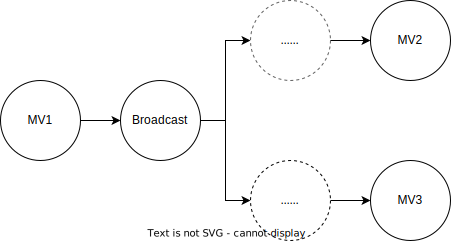
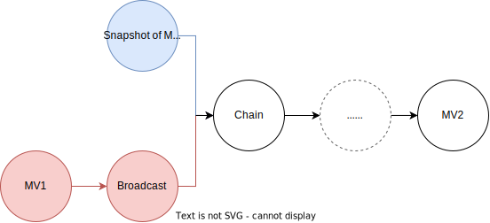

# Create MView on Top of MView

## Background

piestream supports creating a new materialized view (abbreviated as mview) based on the source and another mview, so users can split their data into multiple layers and use mviews' chains to connect them.

In detail, we will support the creation of a materialized view whose source is some other mview(s). **Please note that there should not be a circular dependency on mviews**.

```sql
create table t1 (v1 int, deleted boolean);
create materialized view mv1 as select * from t1 where deleted = false;
create materialized view mv2 as select sum(v1) as sum_v1 from mv1;
create materialized view mv3 as select count(v1) as count_v1 from mv1;
```

## Design

### Broadcast operator

In physical representation, we introduce a dispatcher operator type, *Broadcast*. Broadcast dispatcher, as its name indicates, will dispatch every message to multiple downstreams. To simplify our design, we can assume that every MViewOperator has a `Broadcast` output, with zero or more downstreams.



### Create new mview online

Assume that we already have a materialized view mv1, and we want to create a new materialized view mv2 based on mv1. This is equivalent to a configuration change to Broadcast dispatcher. Before the real change happens, we have to apply the snapshot of mv1 to mv2 first. Therefore, we introduce another operator named *Chain*.

The Chain operator has two inputs. The first one will be a batch query, denoted by the blue patterns in the figure below, which is a finite append-only stream (the snapshot of historical data in the base mview). The second one is its original input, an infinite stream, denoted by the red patterns.



The full process of creation is:

1. The frontend parses the query and sends the plan to StreamManager.
2. StreamManager creates the new actors.
3. StreamManager chooses a change epoch e1, pins a snapshot of mv1 at e1, and sends a barrier with e1 and change info.
4. The broadcast operator receives the barrier, then creates a SnapshotStream of mv1 with e1, and creates a Chain operator, then connects them all. (only changes in the memory).
5. The broadcast operator sends a normal barrier e1 to all downstreams, and continues.
6. The Chain operator consumes all messages from snapshot and receives EOF, then consumes buffered messages from upstream.
7. StreamManager discovered that mv2 has almost caught up with the progress of mv1, and the creation success.

## Drop mview online

Assume that we already have three materialized views mv1, mv2, and mv3. mv2 and mv3 are on top of mv1, so **mv1 is not allowed to be dropped**.

The full process of drop mv3 is:

1. The frontend parses the query and sends the plan to StreamManager.
2. StreamManager chooses a change epoch e1, and sends a barrier with e1 and change info.
3. The broadcast operator sends a normal barrier e1 to all downstreams.
4. The broadcast operator removes the dropped output from its outputs, and continues.
5. StreamManager discovered that mv3 has the epoch e1, then drops extra fragments physically.
